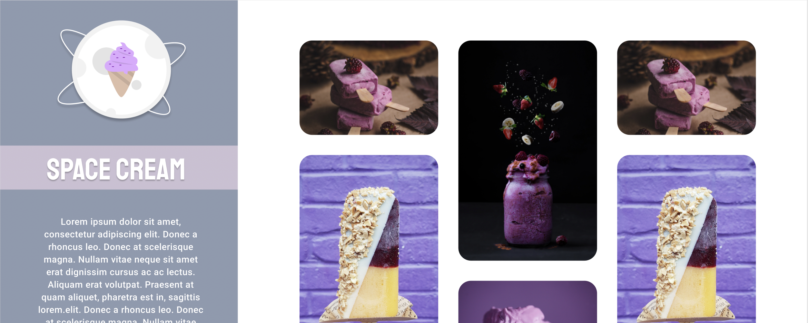

> Projeto Space Cream - Loja virtual de sorvetes

# Projeto do curso Rocketseat - Explorer (estudo sobre responsividade)

  

# 🛠️ Tecnologias Utilizadas

 
  
  
  
  
  
  

 

# 🍨 Sobre o projeto

  O projeto foi uma ideia criada pela Rocketseat no seu curso Explorer. Após a sessão do curso, o projeto e proposto para que o aluno consiga, sozinho, desenvolver suas habilidades em html e css através da pratica!
  
  A ideia do projeto é criar uma loja de sorvetes virtual utilizando o método de mobile first com design responsivo, tendo 4 breakpoints de responsividade; criando cards com posições relativas, animações, transições e display grid com grid template

# 👨‍🎓 O que aprendi

- Revisão do HTML e suas propiedades
- Uso e manuseio de informações extraidas do Figma
- Linguagem CSS e suas propiedades
- Transição, animação e responsividade com CSS
- Grid template
- Refatoração
- Git e Github

# 🎨 Figma

https://efficient-sloth-d85.notion.site/Grid-com-anima-es-5ea8b6051189446ebcda9914f7ac4dc9

# 📧 Contato

